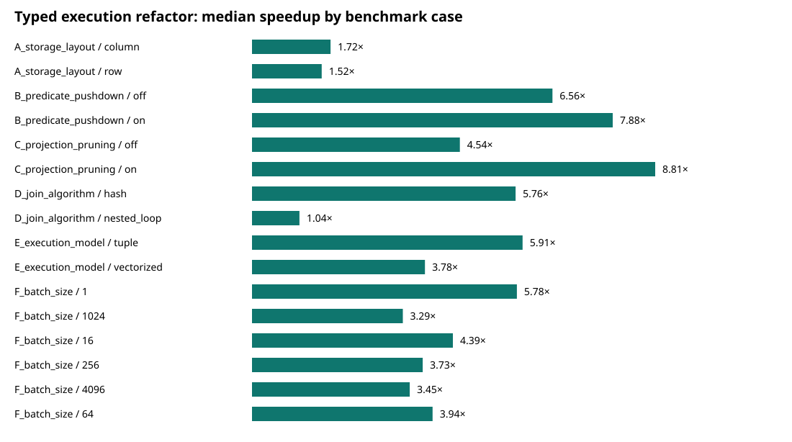
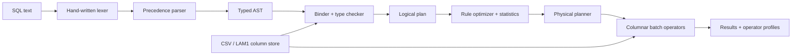

# Lamina SQL


[](LICENSE)

**A vectorized analytical SQL engine written from scratch in Rust, implementing parsing, logical/physical planning, predicate pushdown, columnar execution and hash joins, benchmarked on TPC-H-shaped workloads.**

## Why this matters across industries

Database-internals engineering — a real query planner, predicate pushdown, columnar/vectorized execution, and hash joins built from scratch rather than used off the shelf — is directly relevant to any data-platform or tech infrastructure role, to quant/finance (analytical query performance over trade/market data is a recurring bottleneck), and to consulting engagements needing genuine query-engine understanding rather than just SQL usage. The measured before/after optimization methodology below (real commits, real iterations, explicitly labeled as non-official TPC-H) is the same rigor a data-platform client audit expects.

```text
SQL  SELECT c.region, SUM(o.total) AS revenue ...

└── Limit 3
    └── Sort [revenue]
        └── HashAggregate [groups=1]
            └── HashJoin on=(c.customer_id = o.customer_id)
                ├── ColumnScan customers [columns=2/3]
                └── ColumnScan orders [columns=2/3, pushed_filters=1]

HashJoin [est=137, in=144, out=140]
```



The figure compares 11 release-build iterations from the pre-refactor commit `bcb1c18` with 11 iterations from optimized commit `62586ac`. Both raw runs record the same machine and workload. The 20,000-row generator is deterministic and TPC-H-shaped, but **is not official `dbgen` output and is not a TPC-H-compliant result**.

## Measured results

### Typed-execution refactor versus baseline

| Hot path | Baseline | Typed execution | Measured speedup |
|---|---|---:|---:|
| Pushed filter | 1.517 ms | 0.193 ms | 7.88× |
| Projection-pruned scan | 2.574 ms | 0.292 ms | 8.81× |
| Hash join | 9.642 ms | 1.675 ms | 5.76× |
| Vectorized filter/projection | 2.027 ms | 0.537 ms | 3.78× |

### Current engine: controlled design comparisons

| Experiment | Compared variants | Median execution time | Observed ratio |
|---|---|---:|---:|
| Row vs column scan | row / column | 0.059 / 0.040 ms | column 1.49× faster |
| Predicate pushdown | off / on | 0.528 / 0.193 ms | on 2.74× faster |
| Projection pruning | off / on | 1.776 / 0.292 ms | on 6.07× faster |
| Join algorithm | nested loop / hash | 178.135 / 1.675 ms | hash 106.36× faster |
| Execution model | tuple / batches of 1,024 | 0.577 / 0.537 ms | batches 1.07× faster |
| Batch size | 1 / best observed (1,024) | 0.579 / 0.554 ms | 1,024 was 1.05× faster |

The optimized medians correspond to 103.8M scanned rows/s for pushed filtering, 68.4M rows/s for the projection-pruned scan, and 3.58M rows/s for hash join. These are input-scan rates for the exact benchmark cases, not universal throughput claims.

These ratios apply only to the checked-in configuration and machine. CPU utilization was not sampled; the harness records wall time and estimated result allocation. “Vectorized” means column-oriented batch processing, not SIMD. The small current tuple/batch gap is reported rather than overstated. Read the [benchmark methodology](benchmarks/README.md), [raw baseline](benchmarks/results/2026-08-11-baseline11-bcb1c18/raw.json), [raw optimized run](benchmarks/results/2026-08-11-optimized-final/raw.json), and [generated comparison](benchmarks/results/2026-08-11-optimized-final/comparison.md) before interpreting the figures.

## Architecture



The core does not embed SQLite or DuckDB. `rusqlite` is a development-only dependency used by one differential test as an external semantics oracle. Runtime dependencies are `serde` and `serde_json`; their use is visible in `Cargo.toml`.

## Quick start

Requires stable Rust (verified with Rust 1.93.1).

```bash
cargo run --release -- demo
```

The demo needs no data download or configuration. It constructs two typed tables, prints the SQL, original and optimized logical plans, optimizer actions, physical plan, result table, and operator profile. `make demo` is an equivalent convenience alias on systems with GNU Make.

Query a CSV directly:

```bash
cargo run --release -- query --csv lineitem=data/lineitem.csv \
  "SELECT l_returnflag, SUM(l_extendedprice) AS revenue FROM lineitem GROUP BY l_returnflag ORDER BY revenue DESC"
```

Inspect plans and ASTs:

```bash
cargo run --release -- query --csv t=data.csv "EXPLAIN SELECT a FROM t WHERE b > 10"
cargo run --release -- query --csv t=data.csv "EXPLAIN PHYSICAL SELECT a FROM t WHERE b > 10"
cargo run -- ast "SELECT a + 1 AS next FROM t"
```

Convert CSV to the custom columnar format and query it:

```bash
cargo run --release -- import data.csv data.lam data
cargo run --release -- query --columnar data=data.lam "SELECT COUNT(*) FROM data"
```

## SQL surface

Implemented:

- `SELECT`, `FROM`, `WHERE`, `GROUP BY`, `ORDER BY`, `LIMIT`;
- `INNER JOIN ... ON` with hash and nested-loop implementations;
- `COUNT`, `SUM`, `AVG`, `MIN`, `MAX`;
- qualified/unqualified columns, table aliases, output aliases, arithmetic, comparisons, `AND`/`OR`/`NOT`;
- `EXPLAIN`, `EXPLAIN PHYSICAL`, and JSON AST output;
- `INT64`, `FLOAT64`, `UTF8`, `BOOLEAN`, and null values.

Unsupported constructs fail during lexing, parsing, or binding rather than during operator execution. The subset excludes DDL/DML, subqueries, outer joins, `HAVING`, window functions, casts, dates/decimals, and full SQL three-valued Boolean semantics.

## Implementation details

The lexer and precedence parser are hand-written. The binder resolves tables, aliases, qualified columns, ambiguous names, aggregate scope, and primitive operator types before execution. Logical operators are `Scan`, `Filter`, `Projection`, `Aggregate`, `Join`, `Sort`, and `Limit`.

The optimizer performs:

- constant folding and simple Boolean-filter elimination;
- conjunctive predicate pushdown into scans and individual join inputs;
- projection pruning, leaving unused persisted columns unread;
- statistics-driven inner-join input reordering while preserving output order;
- physical hash/nested-loop selection from equality shape and estimated input size.

Execution retains primitive typed columns through scans and intermediate batches. Filters create selection indices, direct projections bulk-copy typed columns, computed projections evaluate a column at a time per batch, aggregation uses a hash table keyed by group values, and equi-joins build typed allocation-free numeric keys. Common column-versus-literal predicates use specialized kernels; unsupported expression shapes fall back to the general scalar evaluator. Every operator records estimated rows, rows in/out, inclusive elapsed time, and estimated output bytes.

`LAM1` is deliberately small: a magic/version marker, table and field metadata, typed column sections, and per-value null markers. Table statistics include row count, min/max, exact in-memory cardinality, and null count. It is not a durable transactional format.

## Why this is difficult

The interesting work is maintaining semantic and positional invariants across stages. A pushed predicate must be remapped when it crosses a join boundary; pruning must retain columns needed only by a downstream join key; join reordering must preserve the query’s output schema; aggregate expressions need separate update/finalize state; and profiles must remain attached to the selected physical operators. Tests target those boundaries rather than only checking the parser in isolation.

## Tests and quality gates

```bash
make check
```

The current suite contains 30 tests covering lexer/parser behavior, binding and type failures, plans and optimizer rules, statistics-based estimates, typed filter kernels, storage round trips, both join algorithms, cross-numeric join keys, execution, tuple/batch equivalence, generated property cases, benchmark comparison logic, and a differential aggregate query against SQLite. The SQLite dependency is compiled only for tests.

GitHub Actions runs formatting, Clippy with warnings denied, all-target tests, a release build, and RustSec dependency auditing. Dependabot covers Cargo crates and Actions. The workflow is checked in; this local repository has no GitHub remote, so no hosted Actions run is claimed.

## Reproducing benchmarks

```bash
cargo run --release --bin benchmark -- \
  --rows 20000 --iterations 3 \
  --out benchmarks/results/my-run
```

Each run writes environment/software/commit/configuration metadata, every raw observation in JSON and CSV, median summaries, and an SVG generated from those summaries. See [benchmarks/README.md](benchmarks/README.md) and the [technical report](docs/technical-report.md).

## Engineering decisions

Architectural choices and rejected alternatives live in [docs/adr](docs/adr): hand-written SQL front end, typed columns, batch execution, rule optimization, dual join algorithms, and the `LAM1` persistence format.

## Known limitations

- This is a single-process, single-threaded educational engine, not production-ready software.
- Expressions are scalar inside columnar batches; there is no SIMD, JIT, morsel scheduling, or parallel pipeline execution.
- Intermediate operators materialize complete column sets; there is no spill-to-disk or memory budget.
- Cardinality estimation uses min/max and distinct counts for supported shapes, but assumes uniform ranges, ignores correlation, and falls back to 10% for unknown predicates.
- Numeric hash keys normalize through `f64` bits so compatible integer/float keys share buckets; direct typed equality preserves correctness, but very large integers can create extra collisions.
- Null handling is partial and does not implement every SQL three-valued-logic edge case.
- CSV inference is whole-file and the parser supports quoted fields, but not embedded newlines.
- `LAM1` has no checksums, compression, schema evolution, or cross-endian guarantee.
- The benchmark is small, synthetic, single-machine, and excludes DuckDB. No competitiveness claim is made.

## Future work

The next technically meaningful steps are selection vectors without intermediate copies, zone-map pruning from min/max statistics, streaming operators with memory accounting, a cost model calibrated from measurements, parallel pipelines, decimal/date types, and official `dbgen` datasets. SIMD should only be added with before/after counters and benchmark evidence.

## Interview material

CV bullets, a LinkedIn description, and 30-second/two-minute pitches are in [docs/interview-kit.md](docs/interview-kit.md). They use only the checked-in measurements.
